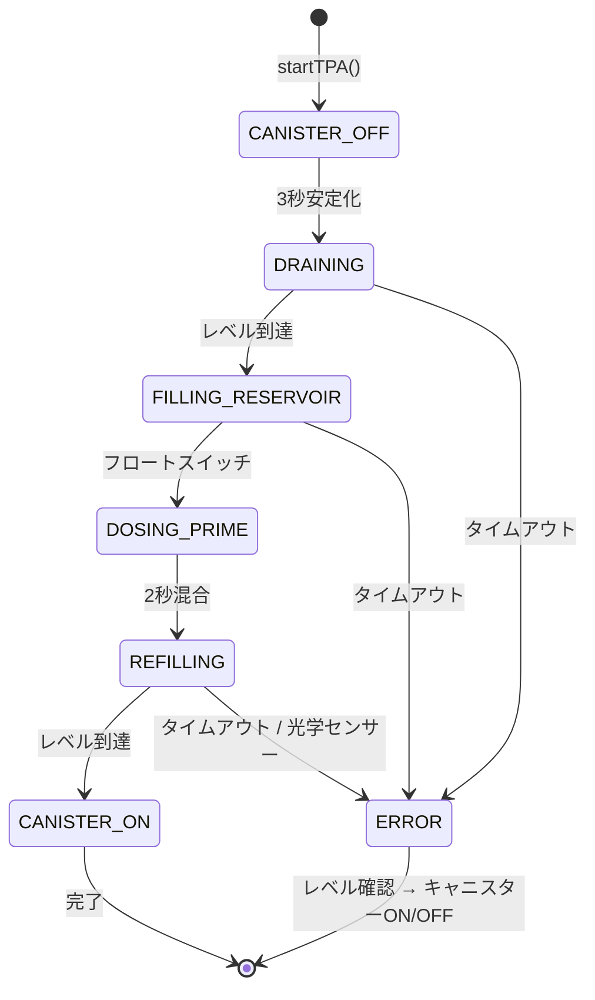
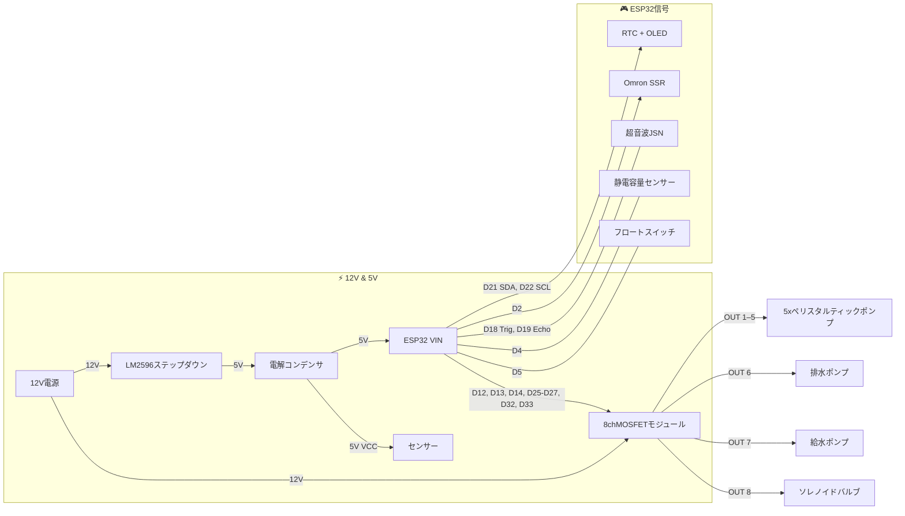

<p align="center">
  
</p>

# IARA

**水槽用自動換水・施肥・ろ過システム** — ESP32ファームウェア。

*ブラジル民話の淡水の精霊「イアラ」にちなんで名付けられました。*


> 🇺🇸 Read in English: [README.md](README.md)
>
> 🇧🇷 Leia em português: [README.pt-BR.md](README.pt-BR.md)

---

## 📖 概要

**IARA**は水草水槽のための完全な組み込みオートメーションシステムです。以下を管理します：

- **換水（TPA）** — 6ステートのステートマシンによる自動排水・給水。
- **施肥** — ペリスタルティックポンプによるスケジュール投与・在庫追跡。
- **ろ過** — SSRリレー（AC電源）によるキャニスターのON/OFF制御。
- **安全** — 連続センサー監視、ウォッチドッグタイマー、緊急シャットダウンモード。

ファームウェアは**ESP32 DevKit V1**上で動作し、**組み込みWebダッシュボード**（React + Vite、LittleFSで配信）、**OLEDディスプレイ**、**DS3231 RTCクロック**、**シリアルコマンドインターフェース**を搭載しています。

---

## 📚 追加ドキュメント

プロジェクトには以下の詳細なハードウェアドキュメントが含まれています：

| ドキュメント | 説明 |
|---|---|
| [`BOM.md`](BOM.md) / [`BOM.ja.md`](BOM.ja.md) | **部品表** — AC、DC、アクチュエーター、センサー、保護、コネクタのレイヤー別全コンポーネントリスト。 |
| [`HARDWARE.md`](HARDWARE.md) / [`HARDWARE.ja.md`](HARDWARE.ja.md) | **ハードウェアアーキテクチャ** — 各レイヤーの配線図、ノイズ保護、センサー用分圧回路、安全実装ノートを含む詳細技術資料。 |

---

## 🏗️ ファームウェアアーキテクチャ

```
main.cpp               ← メインオーケストレーター
├── SafetyWatchdog      ← センサー + 緊急 + メンテナンスモード
├── TimeManager         ← DS3231 RTC + NTP同期
├── FertManager         ← 投与 + NVS重複排除 + 在庫追跡
├── WaterManager        ← 換水ステートマシン（6ステート）
├── DisplayManager      ← OLED SSD1306 128×64
└── WebManager          ← 組み込みWebダッシュボード + シリアルI/F
```

### セーフティファーストループ

```cpp
loop() {
    safety.update();          // 🔴 最高優先度
    if (emergency) return;
    timeMgr.update();
    commands.process();
    schedules.check();
    waterMgr.update();        // 換水ステートマシン
    telemetry.send();
}
```

### 🔄 換水（TPA）フロー

TPAはメインループ内でノンブロッキングに動作する6ステートのステートマシンです。各ステートには安全のため設定可能なタイムアウトがあります。



| ステップ | ステート | 動作内容 |
|---|---|---|
| 1 | **CANISTER_OFF** | キャニスターフィルターをOFF（SSRリレーHIGH）。超音波センサーが安定した読み取りを得られるよう3秒待機。 |
| 2 | **DRAINING** | 排水ポンプON。超音波センサーが水位を監視。目標レベルに到達するまでポンプ稼働（例：10cm低下）。自動キャリブレーション用に流量を測定。 |
| 3 | **FILLING_RESERVOIR** | ソレノイドバルブを開いてリザーバーに水道水を供給。フロートスイッチがリザーバー水位を監視。満水でバルブを閉鎖。 |
| 4 | **DOSING_PRIME** | ペリスタルティックポンプがリザーバーに脱塩素剤（Prime）を投与。2秒間混合を待機。在庫が減算されNVSに保存。 |
| 5 | **REFILLING** | 給水ポンプON、処理済みの水をリザーバーから水槽へ送水。超音波センサーが元のレベルに到達するか、光学センサーが最大レベルを検出（安全遮断）で停止。キャリブレーション用に流量を測定。 |
| 6 | **CANISTER_ON** | キャニスターフィルターを再びON。**TPAサイクル完了。**キャリブレーション済み流量がNVSに保存。 |

**各ステップの安全性：**
- 各ステートにはキャリブレーション済み流量から計算される**動的タイムアウト**あり（`容量 / 流量 × 1.5`）。初回TPAは安全なデフォルト値を使用：**排水30秒、給水15秒**。
- **光学センサー**がリフィル中のハードウェアレベル安全遮断として機能 — 超音波読み取りに関係なく即時停止。
- **緊急中止**はどの時点でも全アクチュエーターをOFFにし、キャニスターフィルターを復元。
- **エラー時**、超音波センサーで水位を確認してからキャニスターを再起動。水位が低すぎる場合（例：排水中のエラー）、キャニスターは**OFFのまま**維持し、空運転によるポンプ損傷を防止。

---

## 🔌 ハードウェア概要

### 主要接続



> 詳細な配線図、分圧回路、保護ノート（フライバックダイオード、スターGND）は [`HARDWARE.ja.md`](HARDWARE.ja.md) を参照してください。
>
> 全コンポーネントリストと数量は [`BOM.ja.md`](BOM.ja.md) を参照してください。

---

## 🛡️ 安全性と信頼性

浸水、機器損傷、魚の損失を防止するため、**安全第一**のアプローチで設計されています。

### ソフトウェア保護

| 保護機能 | 説明 |
|---|---|
| **ハードウェアウォッチドッグ（WDT）** | ESP32タスクWDT、10秒タイムアウト。メインループがフリーズした場合、ESP32が自動的に再起動します。 |
| **SafetyWatchdog** | ループの各イテレーションで最高優先度で実行。オーバーフロー（光学センサー）、緊急事態を検出し、全アクチュエーターを停止します。 |
| **ノンブロッキングループ** | すべての待機状態（キャニスター落ち着き、プライム混合）は`delay()`ではなく`millis()`を使用し、安全ウォッチドッグが待機中も動作し続けます。 |
| **ステートマシンタイムアウト** | TPAの各ステート（`DRAINING`、`FILLING`、`REFILLING`）には設定可能なタイムアウトがあります。超過するとエラー状態に入り、全アクチュエーターを停止します。 |
| **NVS重複排除** | 予期しない再起動後も同日の肥料二重投与を防止します。 |
| **緊急シャットダウン** | `emergency_stop`コマンドで全アクチュエーターを即座に停止します。 |
| **CPUスロットル** | メインループは約100Hz（`delay(10)`）で動作し、過熱を防止しWiFi/TCPスタックにCPUリソースを確保します。 |
| **ポンプ自動キャリブレーション** | TPA中に流量をインラインで測定（Δレベル × リットル/cm / Δ時間）。動的タイムアウト = `(容量 / 流量) × 1.5`。初回TPAは安全なデフォルト（排水30秒/給水15秒）を使用。 |
| **TPA必須設定** | すべての必須パラメータが設定されるまでTPAは開始不可：水槽寸法、リザーバー容量、交換%、キャニスター安全レベル%。無効な値での実行を防止。 |
| **キャニスター安全レベル（%）** | TPAエラー後にキャニスターを安全に再起動するために必要な最小水位（水槽高さの%）。水位がこの閾値を下回る場合（例：排水中のエラー）、キャニスターはOFFのまま維持し、空運転を防止。 |

### ハードウェア推奨事項

| 保護機能 | 説明 |
|---|---|
| **オーバーフローフロートスイッチ** | 最大水位にNC（常閉）フロートスイッチを設置し、給水ポンプの電源に直列接続。水位が上がりすぎた場合にファームウェアに依存せず物理的にポンプを遮断。 |
| **フライバックダイオード** | ポンプにFR154、ソレノイドに1N5822 — 誘導性負荷の電圧スパイクを吸収。 |
| **デカップリングコンデンサ** | ESP32近傍に1000µF、MOSFETモジュール近傍に470µF — ブラウンアウト過渡現象を吸収。 |
| **分圧回路（ECHO）** | JSN-SR04Tのechoピン用5V → 3.3V — ESP32 GPIOを保護。 |

---

## 🖥️ Wokwiシミュレーション

プロジェクトは[Wokwi](https://wokwi.com)シミュレーションを完全サポートしており、**物理ハードウェアなし**でファームウェアをテストできます。

### 前提条件

1. **Wokwi Simulator**拡張機能がインストールされた[VS Code](https://code.visualstudio.com/)。
2. VS Codeにインストールされた[PlatformIO](https://platformio.org/)。

### 手順

1. **Wokwi環境用ファームウェアをビルド：**

   ```bash
   pio run -e wokwi
   ```

2. **シミュレーションを開始：**
   - プロジェクトディレクトリでVS Codeを開きます。
   - `F1` → **Wokwi: Start Simulator** を押します。
   - シミュレーターが`diagram.json`とコンパイル済みファームウェアを読み込みます。

3. **シミュレーションとの対話：**
   - **換水ボタン**（GPIO 15） — 押して換水サイクルを開始。
   - **施肥ボタン**（GPIO 23） — 押して肥料投与を実行。
   - シリアルモニターにリアルタイムでシステムログが表示されます。
   - 仮想WiFiが有効（`wokwi.toml`で`[net] enable = true`）で、Webダッシュボードにアクセス可能。

### Wokwi環境の違い

`wokwi`環境は`-D WOKWI_TEST`フラグを設定し、自動的に以下を調整します：

- **高速タイミング** — 換水サイクルが分ではなく秒で動作。
- **小容量** — クイックテスト用にパラメータを縮小。

### 関連ファイル

| ファイル | 用途 |
|---|---|
| `diagram.json` | 仮想回路の定義（ESP32、ボタン、LED、センサー） |
| `wokwi.toml` | シミュレーター設定（ファームウェアパス、仮想ネットワーク） |
| `platformio.ini`（`[env:wokwi]`） | シミュレーションフラグ付きビルド環境 |

---

## 🧪 テスト

### ユニットテスト実行（ハードウェア不要）

```bash
pio test -e native
```

### カバレッジレポート生成

```bash
pio test -e coverage && ./scripts/coverage.sh
open coverage/index.html
```

### テストスイート

| スイート | テスト数 | カバレッジ |
|---|---|---|
| `test_fert_manager` | 13 | NVS重複排除、在庫、GPIO、永続化 |
| `test_safety_watchdog` | 14 | センサー、緊急事態、メンテナンス |
| `test_water_manager` | 23 | 換水ステートマシン全体 + キャリブレーション |
| `test_time_manager` | 15 | DateTime、スケジューリング、フォーマット |
| `test_notify_manager` | 10 | 通知、フォーマット |

### 📊 コードカバレッジ

| ファイル | カバレッジ |
|---|---|
| `WaterManager.cpp` | 92% |
| `SafetyWatchdog.cpp` | 81% |
| `FertManager.cpp` | 75% |
| `NotifyManager.cpp` | 43% |
| **合計** | **75%** |

> 75のネイティブユニットテストがコミットごとにCIで実行されます。

---

## 🚀 ビルド・デプロイ

### ファームウェアのビルドとフラッシュ

```bash
# ファームウェアビルド
pio run

# ESP32にフラッシュ
pio run --target upload

# シリアルモニター
pio device monitor
```

### フルデプロイ（フロントエンド + ファームウェア）

`Makefile`でワークフロー全体を自動化：

```bash
# 一括：React ビルド → LittlFS アップロード → ファームウェアフラッシュ
make all

# または個別ステップ：
make build-front     # Reactアプリビルド（Vite）
make upload-fs       # 静的ファイルをLittleFSにアップロード
make upload-fw       # C++ファームウェアのビルドとフラッシュ
make monitor         # シリアルモニターを開く
make clean           # 全ビルドをクリーン
```

### フロントエンド（Webダッシュボード）

Webダッシュボードは`frontend/`にあるReact + Vite + Tailwind CSS SPAです。ビルド後、静的ファイルは`data/`にコピーされ、LittleFS経由でESP32にアップロードされます。

```bash
cd frontend && npm install && npm run build
```

---

## ⌨️ シリアルコマンド

| コマンド | 説明 |
|---|---|
| `help` | 利用可能なコマンド一覧 |
| `status` | 現在のシステム状態 |
| `tpa` | 手動換水を開始 |
| `abort` | 実行中の換水を中止 |
| `maint` | メンテナンスモード切替（30分） |
| `fert_time HH MM` | 施肥時刻を設定 |
| `tpa_time DOW HH MM` | 換水スケジュールを設定 |
| `dose CH ML` | チャンネルCH（1–5）の投与量を設定 |
| `reset_stock CH ML` | チャンネルCHの在庫をリセット |
| `set_drain CM` | 排水目標レベルを設定 |
| `set_refill CM` | 給水目標レベルを設定 |
| `emergency_stop` | 全アクチュエーターを停止 |

---

## 📁 プロジェクト構成

```
├── BOM.md                    # 部品表（pt-BR）
├── BOM.en.md                 # 部品表（en-US）
├── BOM.ja.md                 # 部品表（ja-JP）
├── HARDWARE.md               # ハードウェアアーキテクチャ（pt-BR）
├── HARDWARE.en.md            # ハードウェアアーキテクチャ（en-US）
├── HARDWARE.ja.md            # ハードウェアアーキテクチャ（ja-JP）
├── README.md                 # ドキュメント（en-US） — デフォルト
├── README.pt-BR.md           # ドキュメント（pt-BR）
├── README.ja.md              # ドキュメント（ja-JP）
├── Makefile                  # 自動化：フロントエンドビルド + アップロード
├── diagram.json              # Wokwi仮想回路
├── wokwi.toml                # Wokwiシミュレーター設定
├── platformio.ini            # 環境：esp32dev、wokwi、native、coverage
├── include/
│   ├── Config.h              # ピン、タイムアウト、定数
│   ├── SafetyWatchdog.h
│   ├── TimeManager.h
│   ├── FertManager.h
│   ├── WaterManager.h
│   ├── WebManager.h
│   └── web_dashboard.h       # ダッシュボードHTML/CSS/JS（フォールバック）
├── src/
│   ├── main.cpp              # セットアップ + ループ
│   ├── SafetyWatchdog.cpp
│   ├── TimeManager.cpp
│   ├── FertManager.cpp
│   ├── WaterManager.cpp
│   └── WebManager.cpp
├── frontend/                 # React + Vite + Tailwindダッシュボード
│   ├── src/
│   └── vite.config.ts
├── data/                     # 静的ファイル（フロントエンドビルド → LittleFS）
├── test/
│   ├── mocks/                # Arduinoモックレイヤー（GPIO、NVS、RTC）
│   ├── test_fert_manager/
│   ├── test_safety_watchdog/
│   ├── test_water_manager/
│   └── test_time_manager/
├── scripts/
│   └── coverage.sh           # lcovカバレッジレポートジェネレーター
└── .github/workflows/
    └── test.yml              # CI：コミットごとにテスト実行
```

---

## ☕ サポート

このプロジェクトが役に立った場合は、コーヒーをおごってください！

<a href="https://buymeacoffee.com/iara.automatedwaterchange" target="_blank">
  
</a>

---

## 📜 ライセンス

MIT
