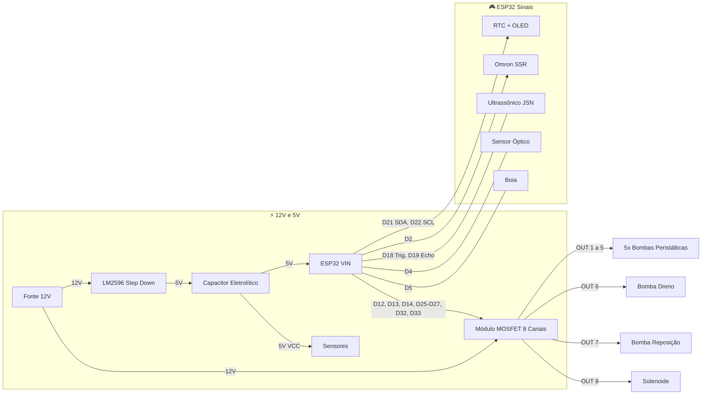

# SATPAFERT 🐟

**S**istema de **A**utomação de **T**PA, **F**ertilização e **F**iltração para aquários — firmware ESP32.


---

## 📊 Code Coverage

| Arquivo | Linhas | Funções | Branches |
|---|---|---|---|
| `FertManager.cpp` | 94.2% | 100% | 77.3% |
| `WaterManager.cpp` | 94.9% | 100% | 72.5% |
| `SafetyWatchdog.cpp` | 80.8% | 92.9% | 66.7% |
| **Overall** | **90.5%** | **98.2%** | **73.0%** |

> 59 testes unitários nativos rodando no CI a cada commit.

---

## 🏗️ Arquitetura

```
main.cpp               ← Orquestrador principal
├── SafetyWatchdog      ← Sensores + emergência + manutenção
├── TimeManager         ← RTC DS3231 + NTP sync
├── FertManager         ← Dosagem + dedup NVS + estoque
├── WaterManager        ← State machine TPA (6 estados)
└── WebManager          ← Dashboard web embarcado + interface Serial
```

### Safety-First Loop

```
loop() {
    safety.update();          // 🔴 Prioridade máxima
    if (emergency) return;
    timeMgr.update();
    commands.process();
    schedules.check();
    waterMgr.update();        // State machine TPA
    telemetry.send();
}
```

---

## 🔌 Hardware e Diagrama de Ligações

### Conexões Principais (Wiring)



### Pinout Detalhado (ESP32)

| Componente | Pino ESP32 | Detalhe |
|---|---|---|
| **MOSFET IN1** (Peristáltica 1) | `D13` | - |
| **MOSFET IN2** (Peristáltica 2) | `D12` | - |
| **MOSFET IN3** (Peristáltica 3) | `D14` | - |
| **MOSFET IN4** (Peristáltica 4) | `D27` | - |
| **MOSFET IN5** (Peristáltica 5) | `D26` | - |
| **MOSFET IN6** (Dreno) | `D25` | - |
| **MOSFET IN7** (Reposição) | `D33` | - |
| **MOSFET IN8** (Solenoide) | `D32` | - |
| **Omron SSR / Filtro AC** | `D2` | CH1 |
| **Ultrassônico JSN-SR04T** | `D18` (Trig), `D19` (Echo) | 5V via LM2596/Capacitor |
| **Sensor Óptico (Nível)** | `D4` (Data) | INPUT_PULLUP, active LOW |
| **Boia (Float Switch)** | `D5` (Wire1) | Wire2 ao GND, INPUT_PULLUP |
| **I2C SDA** (RTC / OLED) | `D21` | - |
| **I2C SCL** (RTC / OLED) | `D22` | - |

---

## 🧪 Testes

### Rodar testes (sem hardware)

```bash
pio test -e native
```

### Gerar relatório de coverage

```bash
./scripts/coverage.sh
open coverage/index.html
```

### Suites

| Suite | Testes | Cobertura |
|---|---|---|
| `test_fert_manager` | 13 | Dedup NVS, estoque, GPIO, persistência |
| `test_safety_watchdog` | 14 | Sensores, emergência, manutenção |
| `test_water_manager` | 17 | State machine TPA completa |
| `test_time_manager` | 15 | DateTime, agendamento, formatação |

---

## 🚀 Build & Upload

```bash
# Compilar
pio run

# Upload para ESP32
pio run --target upload

# Monitor serial
pio device monitor
```

---

## ⌨️ Comandos Serial

| Comando | Descrição |
|---|---|
| `help` | Lista comandos |
| `status` | Estado atual do sistema |
| `tpa` | Inicia TPA manual |
| `abort` | Aborta TPA em andamento |
| `maint` | Toggle modo manutenção (30 min) |
| `fert_time HH MM` | Altera horário fertilização |
| `tpa_time DOW HH MM` | Altera agendamento TPA |
| `dose CH ML` | Seta dose do canal CH (1-5) |
| `reset_stock CH ML` | Reset estoque canal CH |
| `set_drain CM` | Seta alvo de drenagem |
| `set_refill CM` | Seta alvo de reposição |
| `emergency_stop` | Desliga TODOS os atuadores |

---

## 📁 Estrutura

```
├── include/
│   ├── Config.h              # Pins, timeouts, constantes
│   ├── SafetyWatchdog.h
│   ├── TimeManager.h
│   ├── FertManager.h
│   ├── WaterManager.h
│   ├── WebManager.h
│   └── web_dashboard.h       # HTML/CSS/JS do dashboard
├── src/
│   ├── main.cpp              # Setup + loop
│   ├── SafetyWatchdog.cpp
│   ├── TimeManager.cpp
│   ├── FertManager.cpp
│   ├── WaterManager.cpp
│   └── WebManager.cpp
├── test/
│   ├── mocks/                # Arduino mock layer (GPIO, NVS, RTC)
│   ├── test_fert_manager/
│   ├── test_safety_watchdog/
│   ├── test_water_manager/
│   └── test_time_manager/
├── scripts/
│   └── coverage.sh           # Gera relatório lcov
├── .github/workflows/
│   └── test.yml              # CI: testes a cada commit
└── platformio.ini
```

---

## 📜 Licença

MIT
