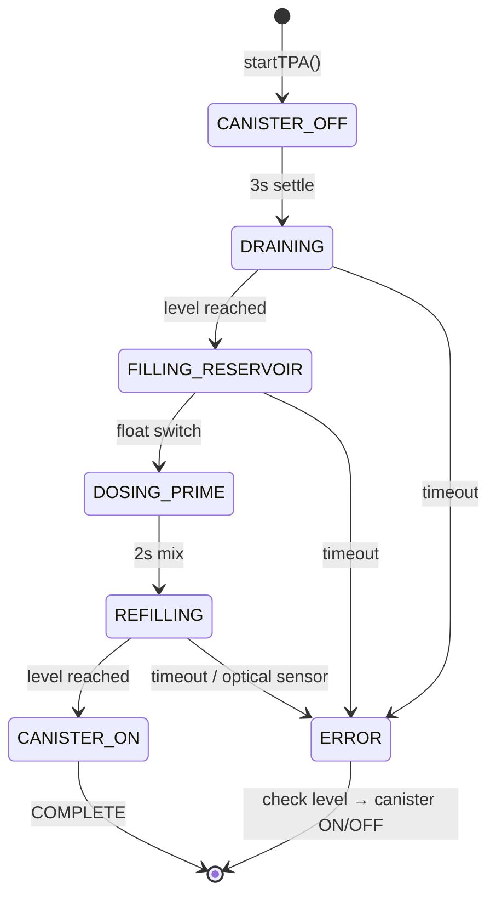
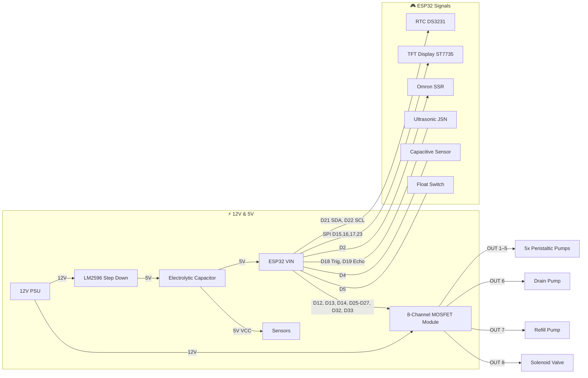

<p align="center">
  
</p>

# IARA

**Automated Water Change, Fertilization & Filtration System for Aquariums** — ESP32 firmware.

*Named after Iara, the freshwater spirit from Brazilian folklore.*


> 🇧🇷 Leia em português: [README.pt-BR.md](README.pt-BR.md)
>
> 🇯🇵 日本語で読む: [README.ja.md](README.ja.md)

---

## 📖 About

**IARA** is a complete embedded system for planted aquarium automation. It manages:

- **Water Change (TPA)** — automated drain & refill with a 6-state state machine.
- **Fertilization** — scheduled dosing via peristaltic pumps with stock tracking.
- **Filtration** — canister on/off control through an SSR relay (AC power).
- **Safety** — continuous sensor monitoring, watchdog timer, and emergency shutdown mode.

The firmware runs on an **ESP32 DevKit V1** and features an **embedded web dashboard** (React + Vite served via LittleFS), **color TFT display (ST7735)**, **DS3231 RTC clock**, and a **serial command interface**.

---

## 📚 Additional Documentation

The project includes detailed hardware documentation in the following files:

| Document | Description |
|---|---|
| [`BOM.md`](BOM.md) | **Bill of Materials** — complete list of all components required for assembly, organized by layer (AC, DC, actuators, sensors, protection, and connectors), with specifications and quantities. |
| [`HARDWARE.md`](HARDWARE.md) | **Hardware Architecture** — detailed technical documentation with wiring diagrams for each layer (AC input, DC bus, and peripherals), including noise protection schemes, voltage dividers for sensors, and safety implementation notes. |
| [`3d_models/`](3d_models/) | **3D Models (OpenSCAD)** — parametric electronics enclosure (`electronics_enclosure.scad`) with full module layout, dosing pump supports (`dosing_pump_support.scad` / `dosing_pump_single.scad`), and drill test plate for verification. |

---

## 🏗️ Firmware Architecture

```
main.cpp               ← Main orchestrator
├── SafetyWatchdog      ← Sensors + emergency + maintenance mode
├── TimeManager         ← DS3231 RTC + NTP sync
├── FertManager         ← Dosing + NVS dedup + stock tracking
├── WaterManager        ← Water change state machine (6 states)
├── DisplayManager      ← TFT ST7735 128×160 (SPI)
└── WebManager          ← Embedded web dashboard + serial interface
```

### Safety-First Loop

```cpp
loop() {
    safety.update();          // 🔴 Highest priority
    if (emergency) return;
    timeMgr.update();
    commands.process();
    schedules.check();
    waterMgr.update();        // Water change state machine
    telemetry.send();
}
```

### 🔄 Water Change (TPA) Flow

The TPA is a 6-state state machine that runs non-blocking inside the main loop. Each state has a configurable timeout for safety.


```mermaid
stateDiagram-v2
    [*] --> CANISTER_OFF: startTPA()
    CANISTER_OFF --> DRAINING: 3s settle
    DRAINING --> FILLING_RESERVOIR: level reached
    FILLING_RESERVOIR --> DOSING_PRIME: float switch
    DOSING_PRIME --> REFILLING: 2s mix
    REFILLING --> CANISTER_ON: level reached
    CANISTER_ON --> [*]: COMPLETE

    DRAINING --> ERROR: timeout
    FILLING_RESERVOIR --> ERROR: timeout
    REFILLING --> ERROR: timeout / optical sensor
    ERROR --> [*]: check level → canister ON/OFF
```

| Step | State | What happens |
|---|---|---|
| 1 | **CANISTER_OFF** | Canister filter is turned off (SSR relay HIGH). Waits 3 seconds for water to settle so the ultrasonic sensor gets a stable reading. |
| 2 | **DRAINING** | Drain pump turns on. Ultrasonic sensor monitors the water level. Pump runs until the target level is reached (e.g. 10 cm drop). Flow rate is measured inline for auto-calibration. |
| 3 | **FILLING_RESERVOIR** | Solenoid valve opens to fill the reservoir with tap water. Float switch monitors reservoir level. Valve closes when reservoir is full. |
| 4 | **DOSING_PRIME** | Peristaltic pump doses dechlorinator (Prime) into the reservoir. Waits 2 seconds for mixing. Stock level is deducted and saved to NVS. |
| 5 | **REFILLING** | Refill pump turns on, pumping treated water from reservoir into the aquarium. Stops when ultrasonic sensor reaches the original level OR optical sensor detects max level (safety cutoff). Flow rate is measured for calibration. |
| 6 | **CANISTER_ON** | Canister filter is turned back on. **TPA cycle complete.** Calibrated flow rates are saved to NVS for next TPA. |

**Safety at every step:**
- Each state has a **dynamic timeout** calculated from calibrated flow rates (`volume / flow × 1.5`). First TPA uses safe defaults: **30s drain, 15s refill**.
- The **optical sensor** acts as a hardware-level safety cutoff during refill — immediate stop regardless of ultrasonic reading.
- **Emergency abort** at any point turns off all actuators and restores the canister filter.
- **On error**, the system checks the water level via ultrasonic before turning the canister back on. If the level is too low (e.g. error during drain), the canister **stays OFF** to avoid running dry and damaging the pump.

---

## 🔌 Hardware Overview

### Main Connections


```mermaid
graph LR
  subgraph Power [⚡ 12V & 5V]
    PSU[12V PSU] -->|12V| MOSFET[8-Channel MOSFET Module]
    PSU -->|12V| LM2596[LM2596 Step Down]
    LM2596 -->|5V| Cap[Electrolytic Capacitor]
    Cap -->|5V| ESP32[ESP32 VIN]
    Cap -->|5V VCC| SENS[Sensors]
  end

  subgraph Signals [🎮 ESP32 Signals]
    ESP32 -->|D21 SDA, D22 SCL| I2C[RTC DS3231]
    ESP32 -->|SPI D15,16,17,23| TFT[TFT Display ST7735]
    ESP32 -->|D12, D13, D14, D25-D27, D32, D33| MOSFET
    ESP32 -->|D2| SSR[Omron SSR]
    ESP32 ---|D18 Trig, D19 Echo| Ultra[Ultrasonic JSN]
    ESP32 ---|D4| Water[Capacitive Sensor]
    ESP32 ---|D5| Float[Float Switch]
  end

  MOSFET -->|OUT 1–5| Peristaltic[5x Peristaltic Pumps]
  MOSFET -->|OUT 6| Drain[Drain Pump]
  MOSFET -->|OUT 7| Refill[Refill Pump]
  MOSFET -->|OUT 8| Solenoid[Solenoid Valve]
```

> For detailed wiring diagrams, voltage dividers, and protection notes (flyback diodes, star GND), see [`HARDWARE.md`](HARDWARE.md).
>
> For the complete component list and quantities, see [`BOM.md`](BOM.md).

---

## 🛡️ Safety & Reliability

The system is designed with a **safety-first** approach to prevent flooding, equipment damage, and fish loss.

### Software Protections

| Protection | Description |
|---|---|
| **Hardware Watchdog (WDT)** | ESP32 Task WDT with 10-second timeout. If the main loop freezes for any reason, the ESP32 automatically reboots. |
| **SafetyWatchdog** | Runs at highest priority every loop iteration. Detects overflow (optical sensor), emergency conditions, and triggers full shutdown of all actuators. |
| **Non-blocking loops** | All wait states (canister settle, prime mixing) use `millis()` instead of `delay()`, so the safety watchdog keeps running during waits. |
| **State machine timeouts** | Each TPA state (`DRAINING`, `FILLING`, `REFILLING`) has a configurable timeout. Exceeding it triggers an error state and shuts down all actuators. |
| **NVS deduplication** | Prevents double-dosing fertilizers on the same day, even after unexpected reboots. |
| **Emergency shutdown** | `emergency_stop` command turns off ALL actuators immediately. |
| **CPU throttle** | Main loop runs at ~100 Hz (`delay(10)`), preventing overheating and leaving CPU headroom for WiFi/TCP stack. |
| **Pump auto-calibration** | Flow rates measured inline during TPA (Δlevel × litersPerCm / Δtime). Dynamic timeouts = `(volume / flow) × 1.5`. First TPA uses safe 30s/15s defaults. |
| **Mandatory TPA config** | TPA will not start unless all required parameters are configured: aquarium dimensions, reservoir volume, drain %, and canister safe level %. Prevents running with invalid/default values. |
| **Canister safe level (%)** | Configurable minimum water level (as % of aquarium height) required to safely turn the canister back on after a TPA error. If the water is below this threshold (e.g. error during drain), the canister stays OFF to prevent running dry. |

### Hardware Recommendations

| Protection | Description |
|---|---|
| **Overflow float switch** | NC (normally closed) float switch at max water level, wired in series with the refill pump power. Cuts the pump physically if water rises too high — independent of firmware. |
| **Flyback diodes** | FR154 on pumps, 1N5822 on solenoid — absorb voltage spikes from inductive loads. |
| **Decoupling capacitors** | 1000µF near ESP32, 470µF near MOSFET module — absorb brownout transients. |
| **Voltage divider (ECHO)** | 5V → 3.3V for JSN-SR04T echo pin — protects ESP32 GPIO. |

---

## 📲 Push Notifications

IARA sends real-time push notifications to your phone via [Pushsafer](https://www.pushsafer.com/). Each notification type can be individually enabled or disabled via the dashboard.

### Notification Types

| Type | Trigger | Example Message |
|---|---|---|
| **TPA Complete** | Water change finished successfully | `✅ TPA completed successfully` |
| **TPA Error** | Timeout or failure during TPA | `⚠️ Drain timeout \| Canister: OFF (nivel 45%, min: 60%)` |
| **Fert Low Stock** | Fertilizer stock below threshold | `⚠️ CH1 Potássio: 15 mL remaining (threshold: 50 mL)` |
| **Emergency** | Emergency shutdown triggered | `🚨 Emergency shutdown activated!` |
| **Fert Complete** | Fertilizer dose completed | `💧 CH2 dosed 5.0 mL` |
| **Daily Level** | Scheduled daily water level report | `📊 Water level: 12.3 cm` |

### Rate Limiting

| Parameter | Value |
|---|---|
| Cooldown per type | 5 minutes (same type won't fire twice) |
| Max per day | 20 notifications total |
| Daily counter reset | Midnight (auto) |

### Setup

1. Create a free account at [pushsafer.com](https://www.pushsafer.com/)
2. Copy your **Private Key** from the Pushsafer dashboard
3. Enter the key via IARA dashboard (`Notifications → API Key`) or via API:
   ```bash
   curl -X POST http://<ESP32_IP>/api/notify/key -d '{"key":"YOUR_KEY"}'
   ```
4. Enable/disable specific notification types via the dashboard

---

## ⚙️ System Configuration

Before the first TPA can run, the system requires all safety-critical parameters to be configured. This ensures the water change operates safely for your specific aquarium setup.

### Required Parameters (Mandatory for TPA)

| Parameter | API Field | Description |
|---|---|---|
| **Aquarium Height** | `aqHeight` | Internal height in cm |
| **Aquarium Length** | `aqLength` | Internal length in cm |
| **Aquarium Width** | `aqWidth` | Internal width in cm |
| **Reservoir Volume** | `reservoirVolume` | Reservoir capacity in liters |
| **TPA Drain %** | `tpaPercent` | Percentage of aquarium volume to drain (e.g. 30%) |
| **Canister Safe Level %** | `canisterSafePct` | Minimum water % required to safely turn canister ON (e.g. 60%) |

> [!IMPORTANT]
> TPA will **not start** until all 6 parameters above are configured. The dashboard shows `tpaConfigReady: true/false` to indicate readiness.

### Optional Parameters

| Parameter | API Field | Description |
|---|---|---|
| **Water Margin** | `aqMarginCm` | Distance from top edge to water surface (cm) |
| **Prime Ratio** | `primeRatio` | mL of dechlorinator per liter of water |
| **Reservoir Safety** | `reservoirSafetyML` | Minimum mL to keep in reservoir for pump safety |
| **TPA Interval** | `tpaInterval` | Days between automatic TPAs (e.g. 7) |
| **TPA Schedule** | `tpaHour`, `tpaMinute` | Time of day for automatic TPA |

### Configuration via API

**Aquarium dimensions:**
```bash
curl -X POST http://<ESP32_IP>/api/config/aquarium \
  -H "Content-Type: application/json" \
  -d '{"aqHeight":45, "aqLength":90, "aqWidth":40, "aqMarginCm":3, "reservoirVolume":20, "primeRatio":0.5}'
```

**TPA schedule + canister safety:**
```bash
curl -X POST http://<ESP32_IP>/api/schedule \
  -H "Content-Type: application/json" \
  -d '{"tpaInterval":7, "tpaHour":10, "tpaMinute":0, "tpaPercent":30, "canisterSafePct":60}'
```

### How Configuration is Stored

All parameters are persisted in **NVS (Non-Volatile Storage)** and survive reboots and power cycles. Configuration can be set via:

1. **Web Dashboard** — React SPA with forms for all parameters
2. **REST API** — JSON endpoints for programmatic access
3. **Serial Commands** — USB serial for debugging and initial setup

### Derived Values (Auto-Calculated)

| Value | Formula | Purpose |
|---|---|---|
| **Aquarium Volume** | `(Height - Margin) × Length × Width / 1000` | Total water volume in liters |
| **Liters per cm** | `Length × Width / 1000` | Volume change per cm of water level |
| **Prime dose** | `Reservoir Volume × Prime Ratio` | Auto-calculated dechlorinator dose |
| **Drain cm** | `(Volume × TPA%) / Liters per cm` | Calculated at TPA start |
| **Canister safe cm** | `EffHeight × (100 - SafePct) / 100` | Ultrasonic distance threshold |
| **Dynamic timeouts** | `(Volume / Flow) × 1.5` | Calculated from calibrated flow rates |

---

## 🖥️ Wokwi Simulation

The project includes full support for [Wokwi](https://wokwi.com) simulation, allowing you to test the firmware **without physical hardware**.

### Prerequisites

1. [VS Code](https://code.visualstudio.com/) with the **Wokwi Simulator** extension installed.
2. [PlatformIO](https://platformio.org/) installed in VS Code.

### Step by Step

1. **Build the firmware for the Wokwi environment:**

   ```bash
   pio run -e wokwi
   ```

2. **Start the simulation:**
   - Open VS Code in the project directory.
   - Press `F1` → **Wokwi: Start Simulator**.
   - The simulator will load `diagram.json` and the compiled firmware (`.pio/build/wokwi/firmware.bin`).

3. **Interact with the simulation:**
   - **Water Change Button** (GPIO 15) — press to start the water change cycle.
   - **Fertilization Button** (GPIO 23) — press to trigger fertilizer dosing.
   - The serial monitor will display system logs in real time.
   - Virtual WiFi is enabled (`[net] enable = true` in `wokwi.toml`), allowing access to the web dashboard.

### Wokwi Environment Differences

The `wokwi` environment sets the `-D WOKWI_TEST` flag, which automatically adjusts:

- **Fast timing** — water change cycles use seconds instead of minutes.
- **Smaller volumes** — reduced parameters for quick testing.

### Relevant Files

| File | Purpose |
|---|---|
| `diagram.json` | Defines the virtual circuit (ESP32, buttons, LEDs, sensors) |
| `wokwi.toml` | Simulator configuration (firmware path, virtual network) |
| `platformio.ini` (`[env:wokwi]`) | Build environment with simulation flags |

---

## 🧪 Testing

### Run unit tests (no hardware required)

```bash
pio test -e native
```

### Generate coverage report

```bash
pio test -e coverage && ./scripts/coverage.sh
open coverage/index.html
```

### Test Suites

| Suite | Tests | Coverage |
|---|---|---|
| `test_fert_manager` | 13 | NVS dedup, stock, GPIO, persistence |
| `test_safety_watchdog` | 14 | Sensors, emergency, maintenance |
| `test_water_manager` | 23 | Full water change state machine + calibration |
| `test_time_manager` | 15 | DateTime, scheduling, formatting |
| `test_notify_manager` | 10 | Notifications, formatting |

### 📊 Code Coverage

| File | Coverage |
|---|---|
| `WaterManager.cpp` | 92% |
| `SafetyWatchdog.cpp` | 81% |
| `FertManager.cpp` | 75% |
| `NotifyManager.cpp` | 43% |
| **Total** | **75%** |

> 75 native unit tests running in CI on every commit.

---

## 🚀 Build & Deploy

### Build and flash firmware

```bash
# Build firmware
pio run

# Flash to ESP32
pio run --target upload

# Serial monitor
pio device monitor
```

### Full deploy (Frontend + Firmware)

The `Makefile` automates the full workflow:

```bash
# All at once: build React → upload LittleFS → flash firmware
make all

# Or individual steps:
make build-front     # Build React app (Vite)
make upload-fs       # Upload static files to LittleFS
make upload-fw       # Build and flash C++ firmware
make monitor         # Open serial monitor
make clean           # Clean all builds
```

### Frontend (Web Dashboard)

The web dashboard is a React + Vite + Tailwind CSS SPA located in `frontend/`. After building, static files are copied to `data/` and uploaded to the ESP32 via LittleFS.

```bash
cd frontend && npm install && npm run build
```

---

## ⌨️ Serial Commands

| Command | Description |
|---|---|
| `help` | List available commands |
| `status` | Current system state |
| `tpa` | Start manual water change |
| `abort` | Abort water change in progress |
| `maint` | Toggle maintenance mode (30 min) |
| `fert_time HH MM` | Set fertilization time |
| `tpa_time DOW HH MM` | Set water change schedule |
| `dose CH ML` | Set dose for channel CH (1–5) |
| `reset_stock CH ML` | Reset stock for channel CH |
| `set_drain CM` | Set drain target level |
| `set_refill CM` | Set refill target level |
| `emergency_stop` | Shut down ALL actuators |

---

## 📁 Project Structure

```
├── BOM.md                    # Bill of Materials (pt-BR)
├── BOM.en.md                 # Bill of Materials (en-US)
├── BOM.ja.md                 # Bill of Materials (ja-JP)
├── HARDWARE.md               # Hardware architecture (pt-BR)
├── 3d_models/                # 3D models for printing and laser cutting
│   ├── electronics_enclosure.scad  # Electronics enclosure (base + lid)
│   ├── dosing_pump_support.scad    # 8-pump dosing support
│   └── dosing_pump_single.scad     # Single pump support
├── HARDWARE.en.md            # Hardware architecture (en-US)
├── HARDWARE.ja.md            # Hardware architecture (ja-JP)
├── README.md                 # Documentation (en-US) — default
├── README.pt-BR.md           # Documentation (pt-BR)
├── README.ja.md              # Documentation (ja-JP)
├── Makefile                  # Automation: build frontend + upload
├── diagram.json              # Wokwi virtual circuit
├── wokwi.toml                # Wokwi simulator config
├── platformio.ini            # Environments: esp32dev, wokwi, native, coverage
├── include/
│   ├── Config.h              # Pins, timeouts, constants
│   ├── SafetyWatchdog.h
│   ├── TimeManager.h
│   ├── FertManager.h
│   ├── WaterManager.h
│   ├── WebManager.h
│   └── web_dashboard.h       # Dashboard HTML/CSS/JS (fallback)
├── src/
│   ├── main.cpp              # Setup + loop
│   ├── SafetyWatchdog.cpp
│   ├── TimeManager.cpp
│   ├── FertManager.cpp
│   ├── WaterManager.cpp
│   └── WebManager.cpp
├── frontend/                 # React + Vite + Tailwind dashboard
│   ├── src/
│   └── vite.config.ts
├── data/                     # Static files (frontend build → LittleFS)
├── test/
│   ├── mocks/                # Arduino mock layer (GPIO, NVS, RTC)
│   ├── test_fert_manager/
│   ├── test_safety_watchdog/
│   ├── test_water_manager/
│   └── test_time_manager/
├── scripts/
│   └── coverage.sh           # lcov coverage report generator
└── .github/workflows/
    └── test.yml              # CI: tests on every commit
```

---

## ☕ Support

If you find this project helpful, consider buying me a coffee!

<a href="https://buymeacoffee.com/iara.automatedwaterchange" target="_blank">
  
</a>

---

## 📜 License

MIT
