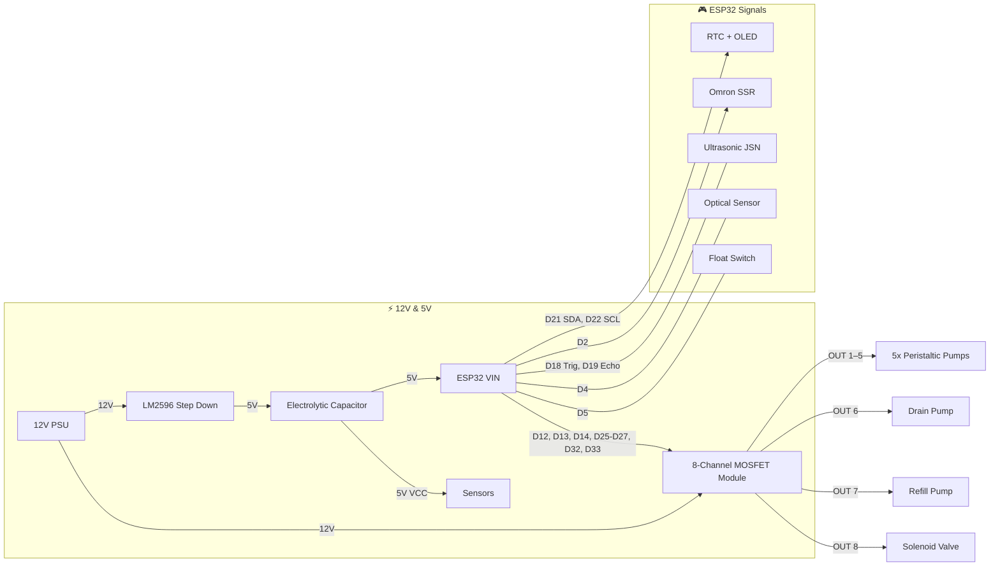

<p align="center">
  
</p>

# IARA

**Automated Water Change, Fertilization & Filtration System for Aquariums** — ESP32 firmware.

*Named after Iara, the freshwater spirit from Brazilian folklore.*


> 🇧🇷 Leia em português: [README.pt-BR.md](README.pt-BR.md)

---

## 📖 About

**IARA** is a complete embedded system for planted aquarium automation. It manages:

- **Water Change (TPA)** — automated drain & refill with a 6-state state machine.
- **Fertilization** — scheduled dosing via peristaltic pumps with stock tracking.
- **Filtration** — canister on/off control through an SSR relay (AC power).
- **Safety** — continuous sensor monitoring, watchdog timer, and emergency shutdown mode.

The firmware runs on an **ESP32 DevKit V1** and features an **embedded web dashboard** (React + Vite served via LittleFS), **OLED display**, **DS3231 RTC clock**, and a **serial command interface**.

---

## 📚 Additional Documentation

The project includes detailed hardware documentation in the following files:

| Document | Description |
|---|---|
| [`BOM.md`](BOM.md) | **Bill of Materials** — complete list of all components required for assembly, organized by layer (AC, DC, actuators, sensors, protection, and connectors), with specifications and quantities. |
| [`HARDWARE.md`](HARDWARE.md) | **Hardware Architecture** — detailed technical documentation with wiring diagrams for each layer (AC input, DC bus, and peripherals), including noise protection schemes, voltage dividers for sensors, and safety implementation notes. |

---

## 🏗️ Firmware Architecture

```
main.cpp               ← Main orchestrator
├── SafetyWatchdog      ← Sensors + emergency + maintenance mode
├── TimeManager         ← DS3231 RTC + NTP sync
├── FertManager         ← Dosing + NVS dedup + stock tracking
├── WaterManager        ← Water change state machine (6 states)
├── DisplayManager      ← OLED SSD1306 128×64
└── WebManager          ← Embedded web dashboard + serial interface
```

### Safety-First Loop

```cpp
loop() {
    safety.update();          // 🔴 Highest priority
    if (emergency) return;
    timeMgr.update();
    commands.process();
    schedules.check();
    waterMgr.update();        // Water change state machine
    telemetry.send();
}
```

---

## 🔌 Hardware Overview

### Main Connections


```mermaid
graph LR
  subgraph Power [⚡ 12V & 5V]
    PSU[12V PSU] -->|12V| MOSFET[8-Channel MOSFET Module]
    PSU -->|12V| LM2596[LM2596 Step Down]
    LM2596 -->|5V| Cap[Electrolytic Capacitor]
    Cap -->|5V| ESP32[ESP32 VIN]
    Cap -->|5V VCC| SENS[Sensors]
  end

  subgraph Signals [🎮 ESP32 Signals]
    ESP32 -->|D21 SDA, D22 SCL| I2C[RTC + OLED]
    ESP32 -->|D12, D13, D14, D25-D27, D32, D33| MOSFET
    ESP32 -->|D2| SSR[Omron SSR]
    ESP32 ---|D18 Trig, D19 Echo| Ultra[Ultrasonic JSN]
    ESP32 ---|D4| Water[Optical Sensor]
    ESP32 ---|D5| Float[Float Switch]
  end

  MOSFET -->|OUT 1–5| Peristaltic[5x Peristaltic Pumps]
  MOSFET -->|OUT 6| Drain[Drain Pump]
  MOSFET -->|OUT 7| Refill[Refill Pump]
  MOSFET -->|OUT 8| Solenoid[Solenoid Valve]
```

> For detailed wiring diagrams, voltage dividers, and protection notes (flyback diodes, star GND), see [`HARDWARE.md`](HARDWARE.md).
>
> For the complete component list and quantities, see [`BOM.md`](BOM.md).

---

## 🖥️ Wokwi Simulation

The project includes full support for [Wokwi](https://wokwi.com) simulation, allowing you to test the firmware **without physical hardware**.

### Prerequisites

1. [VS Code](https://code.visualstudio.com/) with the **Wokwi Simulator** extension installed.
2. [PlatformIO](https://platformio.org/) installed in VS Code.

### Step by Step

1. **Build the firmware for the Wokwi environment:**

   ```bash
   pio run -e wokwi
   ```

2. **Start the simulation:**
   - Open VS Code in the project directory.
   - Press `F1` → **Wokwi: Start Simulator**.
   - The simulator will load `diagram.json` and the compiled firmware (`.pio/build/wokwi/firmware.bin`).

3. **Interact with the simulation:**
   - **Water Change Button** (GPIO 15) — press to start the water change cycle.
   - **Fertilization Button** (GPIO 23) — press to trigger fertilizer dosing.
   - The serial monitor will display system logs in real time.
   - Virtual WiFi is enabled (`[net] enable = true` in `wokwi.toml`), allowing access to the web dashboard.

### Wokwi Environment Differences

The `wokwi` environment sets the `-D WOKWI_TEST` flag, which automatically adjusts:

- **Fast timing** — water change cycles use seconds instead of minutes.
- **Smaller volumes** — reduced parameters for quick testing.

### Relevant Files

| File | Purpose |
|---|---|
| `diagram.json` | Defines the virtual circuit (ESP32, buttons, LEDs, sensors) |
| `wokwi.toml` | Simulator configuration (firmware path, virtual network) |
| `platformio.ini` (`[env:wokwi]`) | Build environment with simulation flags |

---

## 🧪 Testing

### Run unit tests (no hardware required)

```bash
pio test -e native
```

### Generate coverage report

```bash
pio test -e coverage && ./scripts/coverage.sh
open coverage/index.html
```

### Test Suites

| Suite | Tests | Coverage |
|---|---|---|
| `test_fert_manager` | 13 | NVS dedup, stock, GPIO, persistence |
| `test_safety_watchdog` | 14 | Sensors, emergency, maintenance |
| `test_water_manager` | 17 | Full water change state machine |
| `test_time_manager` | 15 | DateTime, scheduling, formatting |

### 📊 Code Coverage

| File | Lines | Functions | Branches |
|---|---|---|---|
| `FertManager.cpp` | 94.2% | 100% | 77.3% |
| `WaterManager.cpp` | 94.9% | 100% | 72.5% |
| `SafetyWatchdog.cpp` | 80.8% | 92.9% | 66.7% |
| **Overall** | **90.5%** | **98.2%** | **73.0%** |

> 59 native unit tests running in CI on every commit.

---

## 🚀 Build & Deploy

### Build and flash firmware

```bash
# Build firmware
pio run

# Flash to ESP32
pio run --target upload

# Serial monitor
pio device monitor
```

### Full deploy (Frontend + Firmware)

The `Makefile` automates the full workflow:

```bash
# All at once: build React → upload LittleFS → flash firmware
make all

# Or individual steps:
make build-front     # Build React app (Vite)
make upload-fs       # Upload static files to LittleFS
make upload-fw       # Build and flash C++ firmware
make monitor         # Open serial monitor
make clean           # Clean all builds
```

### Frontend (Web Dashboard)

The web dashboard is a React + Vite + Tailwind CSS SPA located in `frontend/`. After building, static files are copied to `data/` and uploaded to the ESP32 via LittleFS.

```bash
cd frontend && npm install && npm run build
```

---

## ⌨️ Serial Commands

| Command | Description |
|---|---|
| `help` | List available commands |
| `status` | Current system state |
| `tpa` | Start manual water change |
| `abort` | Abort water change in progress |
| `maint` | Toggle maintenance mode (30 min) |
| `fert_time HH MM` | Set fertilization time |
| `tpa_time DOW HH MM` | Set water change schedule |
| `dose CH ML` | Set dose for channel CH (1–5) |
| `reset_stock CH ML` | Reset stock for channel CH |
| `set_drain CM` | Set drain target level |
| `set_refill CM` | Set refill target level |
| `emergency_stop` | Shut down ALL actuators |

---

## 📁 Project Structure

```
├── BOM.md                    # Bill of Materials
├── HARDWARE.md               # Hardware architecture & wiring diagrams
├── README.md                 # Documentation (en-US) — default
├── README.pt-BR.md           # Documentation (pt-BR)
├── Makefile                  # Automation: build frontend + upload
├── diagram.json              # Wokwi virtual circuit
├── wokwi.toml                # Wokwi simulator config
├── platformio.ini            # Environments: esp32dev, wokwi, native, coverage
├── include/
│   ├── Config.h              # Pins, timeouts, constants
│   ├── SafetyWatchdog.h
│   ├── TimeManager.h
│   ├── FertManager.h
│   ├── WaterManager.h
│   ├── WebManager.h
│   └── web_dashboard.h       # Dashboard HTML/CSS/JS (fallback)
├── src/
│   ├── main.cpp              # Setup + loop
│   ├── SafetyWatchdog.cpp
│   ├── TimeManager.cpp
│   ├── FertManager.cpp
│   ├── WaterManager.cpp
│   └── WebManager.cpp
├── frontend/                 # React + Vite + Tailwind dashboard
│   ├── src/
│   └── vite.config.ts
├── data/                     # Static files (frontend build → LittleFS)
├── test/
│   ├── mocks/                # Arduino mock layer (GPIO, NVS, RTC)
│   ├── test_fert_manager/
│   ├── test_safety_watchdog/
│   ├── test_water_manager/
│   └── test_time_manager/
├── scripts/
│   └── coverage.sh           # lcov coverage report generator
└── .github/workflows/
    └── test.yml              # CI: tests on every commit
```

---

## 📜 License

MIT
