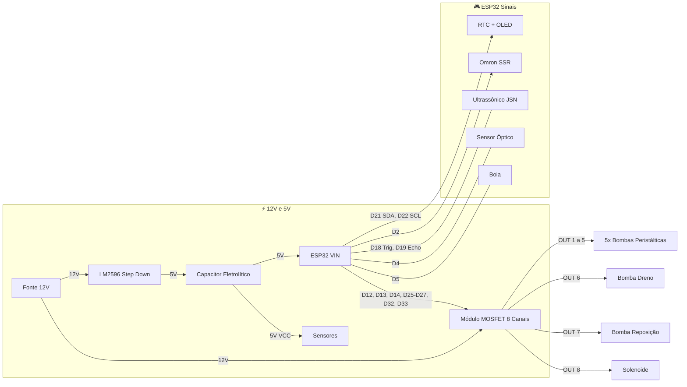

<p align="center">
  
</p>

# IARA

**Sistema de automação de TPA, fertilização e filtração para aquários** — firmware ESP32.

*Nomeado em homenagem a Iara, o espírito das águas doces do folclore brasileiro.*


> 🇺🇸 Read in English: [README.md](README.md)

---

## 📖 Sobre o Projeto

O **IARA** é um sistema embarcado completo para automação de aquários plantados. Ele gerencia:

- **TPA (Troca Parcial de Água)** — drenagem e reposição automática com máquina de estados.
- **Fertilização** — dosagem programada via bombas peristálticas com controle de estoque.
- **Filtração** — controle liga/desliga do canister via relé SSR (corrente AC).
- **Segurança** — monitoramento contínuo de sensores, watchdog e modo emergência.

O firmware roda em um **ESP32 DevKit V1** e conta com **dashboard web embarcado** (React + Vite servido via LittleFS), **display OLED**, **relógio RTC DS3231** e interface via **comandos serial**.

---

## 📚 Documentação Complementar

O projeto possui documentação detalhada de hardware organizada nos seguintes arquivos:

| Documento | Descrição |
|---|---|
| [`BOM.md`](BOM.md) | **Bill of Materials** — lista completa de todos os componentes necessários para montagem, organizada por camadas (AC, DC, atuadores, sensores, proteção e conectores), com especificações e quantidades. |
| [`HARDWARE.md`](HARDWARE.md) | **Arquitetura de Hardware** — documentação técnica detalhada com diagramas de ligação de cada camada (entrada AC, barramento DC e periféricos), incluindo esquemas de proteção contra ruído, divisor de tensão para sensores e notas de segurança para implementação. |

---

## 🏗️ Arquitetura do Firmware

```
main.cpp               ← Orquestrador principal
├── SafetyWatchdog      ← Sensores + emergência + manutenção
├── TimeManager         ← RTC DS3231 + NTP sync
├── FertManager         ← Dosagem + dedup NVS + estoque
├── WaterManager        ← State machine TPA (6 estados)
├── DisplayManager      ← OLED SSD1306 128×64
└── WebManager          ← Dashboard web embarcado + interface Serial
```

### Safety-First Loop

```cpp
loop() {
    safety.update();          // 🔴 Prioridade máxima
    if (emergency) return;
    timeMgr.update();
    commands.process();
    schedules.check();
    waterMgr.update();        // State machine TPA
    telemetry.send();
}
```

---

## 🔌 Hardware Resumo

### Conexões Principais



> Para diagramas de ligação detalhados, divisores de tensão e notas de proteção (flyback, GND estrela), consulte [`HARDWARE.md`](HARDWARE.md).
>
> Para a lista completa de componentes e quantidades, consulte [`BOM.md`](BOM.md).

---

## 🖥️ Simulação no Wokwi

O projeto inclui suporte completo para simulação no [Wokwi](https://wokwi.com), permitindo testar o firmware **sem hardware físico**.

### Pré-requisitos

1. [VS Code](https://code.visualstudio.com/) com a extensão **Wokwi Simulator** instalada.
2. [PlatformIO](https://platformio.org/) instalado no VS Code.

### Passo a passo

1. **Compile o firmware para o environment Wokwi:**

   ```bash
   pio run -e wokwi
   ```

2. **Inicie a simulação:**
   - Abra o VS Code no diretório do projeto.
   - Pressione `F1` → **Wokwi: Start Simulator**.
   - O simulador carregará o `diagram.json` e o firmware compilado (`.pio/build/wokwi/firmware.bin`).

3. **Interaja com a simulação:**
   - **Botão TPA** (GPIO 15) — pressione para iniciar o ciclo de troca parcial de água.
   - **Botão Fertilização** (GPIO 23) — pressione para disparar a dosagem de fertilizantes.
   - O monitor serial exibirá os logs do sistema em tempo real.
   - A rede WiFi virtual está habilitada (`[net] enable = true` no `wokwi.toml`), permitindo acessar o dashboard web.

### Diferenças do environment Wokwi

O environment `wokwi` define a flag `-D WOKWI_TEST` que ajusta automáticamente:

- **Temporização rápida** — os ciclos de TPA usam segundos em vez de minutos.
- **Volumes menores** — parâmetros reduzidos para testes rápidos.

### Arquivos relevantes

| Arquivo | Função |
|---|---|
| `diagram.json` | Define o circuito virtual (ESP32, botões, LEDs, sensores) |
| `wokwi.toml` | Configuração do simulador (firmware path, rede virtual) |
| `platformio.ini` (`[env:wokwi]`) | Environment de build com flags de simulação |

---

## 🧪 Testes

### Rodar testes unitários (sem hardware)

```bash
pio test -e native
```

### Gerar relatório de coverage

```bash
pio test -e coverage && ./scripts/coverage.sh
open coverage/index.html
```

### Suites de Testes

| Suite | Testes | Cobertura |
|---|---|---|
| `test_fert_manager` | 13 | Dedup NVS, estoque, GPIO, persistência |
| `test_safety_watchdog` | 14 | Sensores, emergência, manutenção |
| `test_water_manager` | 17 | State machine TPA completa |
| `test_time_manager` | 15 | DateTime, agendamento, formatação |

### 📊 Code Coverage

| Arquivo | Linhas | Funções | Branches |
|---|---|---|---|
| `FertManager.cpp` | 94.2% | 100% | 77.3% |
| `WaterManager.cpp` | 94.9% | 100% | 72.5% |
| `SafetyWatchdog.cpp` | 80.8% | 92.9% | 66.7% |
| **Overall** | **90.5%** | **98.2%** | **73.0%** |

> 59 testes unitários nativos rodando no CI a cada commit.

---

## 🚀 Build & Deploy

### Compilar e enviar firmware

```bash
# Compilar firmware
pio run

# Upload para ESP32
pio run --target upload

# Monitor serial
pio device monitor
```

### Deploy completo (Frontend + Firmware)

O `Makefile` automatiza o fluxo completo:

```bash
# Tudo de uma vez: build React → upload LittleFS → upload Firmware
make all

# Ou etapas separadas:
make build-front     # Build do React (Vite)
make upload-fs       # Upload arquivos estáticos para LittleFS
make upload-fw       # Compilar e enviar firmware C++
make monitor         # Abrir monitor serial
make clean           # Limpar builds
```

### Frontend (Dashboard Web)

O dashboard web é uma SPA React + Vite + Tailwind CSS localizada em `frontend/`. Após o build, os arquivos estáticos são copiados para `data/` e enviados ao ESP32 via LittleFS.

```bash
cd frontend && npm install && npm run build
```

---

## ⌨️ Comandos Serial

| Comando | Descrição |
|---|---|
| `help` | Lista comandos |
| `status` | Estado atual do sistema |
| `tpa` | Inicia TPA manual |
| `abort` | Aborta TPA em andamento |
| `maint` | Toggle modo manutenção (30 min) |
| `fert_time HH MM` | Altera horário fertilização |
| `tpa_time DOW HH MM` | Altera agendamento TPA |
| `dose CH ML` | Seta dose do canal CH (1-5) |
| `reset_stock CH ML` | Reset estoque canal CH |
| `set_drain CM` | Seta alvo de drenagem |
| `set_refill CM` | Seta alvo de reposição |
| `emergency_stop` | Desliga TODOS os atuadores |

---

## 📁 Estrutura do Projeto

```
├── BOM.md                    # Lista de materiais (Bill of Materials)
├── HARDWARE.md               # Arquitetura de hardware e diagramas de ligação
├── Makefile                  # Automação: build frontend + upload
├── diagram.json              # Circuito virtual Wokwi
├── wokwi.toml                # Configuração do simulador Wokwi
├── platformio.ini            # Environments: esp32dev, wokwi, native, coverage
├── include/
│   ├── Config.h              # Pins, timeouts, constantes
│   ├── SafetyWatchdog.h
│   ├── TimeManager.h
│   ├── FertManager.h
│   ├── WaterManager.h
│   ├── WebManager.h
│   └── web_dashboard.h       # HTML/CSS/JS do dashboard (fallback)
├── src/
│   ├── main.cpp              # Setup + loop
│   ├── SafetyWatchdog.cpp
│   ├── TimeManager.cpp
│   ├── FertManager.cpp
│   ├── WaterManager.cpp
│   └── WebManager.cpp
├── frontend/                 # Dashboard React + Vite + Tailwind
│   ├── src/
│   └── vite.config.ts
├── data/                     # Arquivos estáticos (build do frontend → LittleFS)
├── test/
│   ├── mocks/                # Arduino mock layer (GPIO, NVS, RTC)
│   ├── test_fert_manager/
│   ├── test_safety_watchdog/
│   ├── test_water_manager/
│   └── test_time_manager/
├── scripts/
│   └── coverage.sh           # Gera relatório lcov
└── .github/workflows/
    └── test.yml              # CI: testes a cada commit
```

---

## 📜 Licença

MIT
