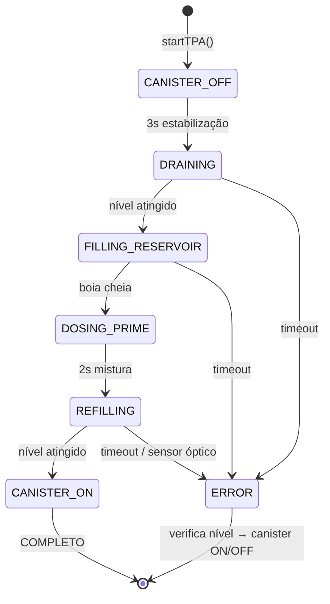
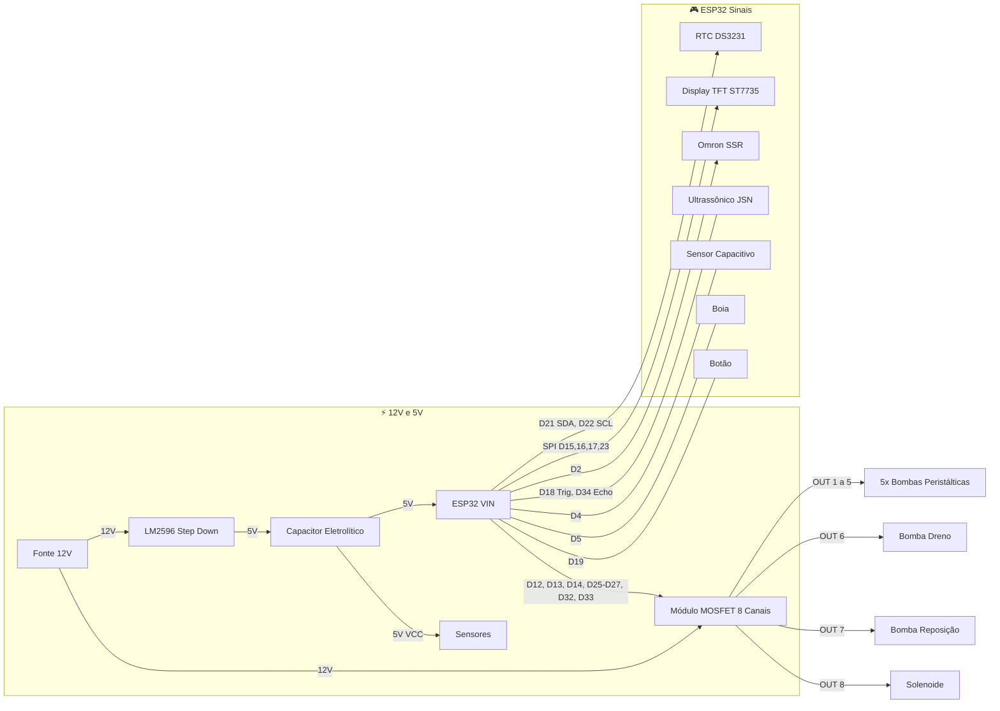

<p align="center">
  
</p>

# IARA

**Sistema de automação de TPA, fertilização e filtração para aquários** — firmware ESP32.

*Nomeado em homenagem a Iara, o espírito das águas doces do folclore brasileiro.*


> 🇺🇸 Read in English: [README.md](README.md)
>
> 🇯🇵 日本語で読む: [README.ja.md](README.ja.md)

---

## 📖 Sobre o Projeto

O **IARA** é um sistema embarcado completo para automação de aquários plantados. Ele gerencia:

- **TPA (Troca Parcial de Água)** — drenagem e reposição automática com máquina de estados.
- **Fertilização** — dosagem programada via bombas peristálticas com controle de estoque.
- **Filtração** — controle liga/desliga do canister via relé SSR (corrente AC).
- **Segurança** — monitoramento contínuo de sensores, watchdog e modo emergência.

O firmware roda em um **ESP32 DevKit V1** e conta com **dashboard web embarcado** (React + Vite servido via LittleFS), **display TFT colorido (ST7735)**, **relógio RTC DS3231** e interface via **comandos serial**.

---

## 📚 Documentação Complementar

O projeto possui documentação detalhada de hardware organizada nos seguintes arquivos:

| Documento | Descrição |
|---|---|
| [`BOM.md`](BOM.md) | **Bill of Materials** — lista completa de todos os componentes necessários para montagem, organizada por camadas (AC, DC, atuadores, sensores, proteção e conectores), com especificações e quantidades. |
| [`HARDWARE.md`](HARDWARE.md) | **Arquitetura de Hardware** — documentação técnica detalhada com diagramas de ligação de cada camada (entrada AC, barramento DC e periféricos), incluindo esquemas de proteção contra ruído, divisor de tensão para sensores e notas de segurança para implementação. |
| [`3d_models/`](3d_models/) | **Modelos 3D (OpenSCAD)** — caixa de eletrônica paramétrica (`electronics_enclosure.scad`) com layout de todos os módulos, suporte para bombas dosadoras (`dosing_pump_support.scad` / `dosing_pump_single.scad`), e placa de teste de furação. |

---

## 🏗️ Arquitetura do Firmware

```
main.cpp               ← Orquestrador principal
├── SafetyWatchdog      ← Sensores + emergência + manutenção
├── TimeManager         ← RTC DS3231 + NTP sync
├── FertManager         ← Dosagem + dedup NVS + estoque
├── WaterManager        ← State machine TPA (6 estados)
├── DisplayManager      ← TFT ST7735 128×160 (SPI)
└── WebManager          ← Dashboard web embarcado + interface Serial
```

### Safety-First Loop

```cpp
loop() {
    safety.update();          // 🔴 Prioridade máxima
    if (emergency) return;
    timeMgr.update();
    commands.process();
    schedules.check();
    waterMgr.update();        // State machine TPA
    telemetry.send();
}
```

### 🔄 Fluxo da Troca de Água (TPA)

A TPA é uma máquina de estados com 6 estados, rodando de forma não-bloqueante dentro do loop principal. Cada estado tem timeout configurável para segurança.



| Passo | Estado | O que acontece |
|---|---|---|
| 1 | **CANISTER_OFF** | O filtro canister é desligado (SSR HIGH). Espera 3 segundos para a água estabilizar e o sensor ultrassônico ter uma leitura estável. |
| 2 | **DRAINING** | Bomba de drenagem liga. Sensor ultrassônico monitora o nível da água. A bomba roda até atingir o nível alvo (ex: queda de 10 cm). A vazão é medida para auto-calibração. |
| 3 | **FILLING_RESERVOIR** | Válvula solenoide abre para encher o reservatório com água da torneira. Boia float switch monitora o nível. Válvula fecha quando o reservatório está cheio. |
| 4 | **DOSING_PRIME** | Bomba peristáltica dosa desclorificante (Prime) no reservatório. Espera 2 segundos para mistura. Estoque é deduzido e salvo no NVS. |
| 5 | **REFILLING** | Bomba de recalque liga, enviando água tratada do reservatório para o aquário. Para quando o ultrassônico atinge o nível original OU o sensor óptico detecta nível máximo (corte de segurança). Vazão é medida para calibração. |
| 6 | **CANISTER_ON** | Filtro canister é religado. **Ciclo de TPA completo.** Vazões calibradas são salvas no NVS para a próxima TPA. |

**Segurança em cada etapa:**
- Cada estado tem **timeout dinâmico** calculado a partir das vazões calibradas (`volume / vazão × 1.5`). A primeira TPA usa defaults seguros: **30s drenagem, 15s recalque**.
- O **sensor óptico** atua como corte de segurança em nível de hardware durante o refill — parada imediata independente da leitura ultrassônica.
- **Abort de emergência** em qualquer ponto desliga todos os atuadores e restaura o filtro canister.
- **Em caso de erro**, o sistema verifica o nível da água via ultrassônico antes de religar o canister. Se o nível estiver muito baixo (ex: erro durante drenagem), o canister **permanece OFF** para evitar funcionar a seco e danificar a bomba.

---

## 🔌 Hardware Resumo

### Conexões Principais



> Para diagramas de ligação detalhados, divisores de tensão e notas de proteção (flyback, GND estrela), consulte [`HARDWARE.md`](HARDWARE.md).
>
> Para a lista completa de componentes e quantidades, consulte [`BOM.md`](BOM.md).

### Diagrama de Conexões ESP32

| GPIO | Função | Componente | Direção | Protocolo |
|------|--------|------------|---------|-----------|
| **D2** | Canister ON/OFF | Relé SSR Omron | Saída | Digital |
| **D4** | Sensor de nível máx. | XKC-Y25-NPN (capacitivo) | Entrada (PULLUP) | Digital |
| **D5** | Boia do reservatório | Float Switch horizontal | Entrada (PULLUP) | Digital |
| **D12** | Fertilizante CH2 | MOSFET canal 2 | Saída | Digital |
| **D13** | Fertilizante CH1 | MOSFET canal 1 | Saída | Digital |
| **D14** | Fertilizante CH3 | MOSFET canal 3 | Saída | Digital |
| **D15** | TFT CS | Display ST7735 (CS) | Saída | SPI (CS) |
| **D16** | TFT SCK | Display ST7735 (SCK) | Saída | SPI (SCK) |
| **D17** | TFT A0 (Data/Command) | Display ST7735 (A0) | Saída | SPI (DC) |
| **D18** | Trigger ultrassônico | JSN-SR04T | Saída | Digital |
| **D19** | Botão de contato | Botão Push/Tactile (Painel) | Entrada (PULLUP) | Digital |
| **D21** | SDA | RTC DS3231 | Bidirecional | I2C |
| **D22** | SCL | RTC DS3231 | Bidirecional | I2C |
| **D23** | TFT SDA (Data) | Display ST7735 (SDA) | Saída | SPI (MOSI) |
| **D25** | Bomba de drenagem | MOSFET canal 6 | Saída | Digital |
| **D26** | Prime (desclorador) | MOSFET canal 5 | Saída | Digital |
| **D27** | Fertilizante CH4 | MOSFET canal 4 | Saída | Digital |
| **D32** | Válvula solenóide | MOSFET canal 8 | Saída | Digital |
| **D33** | Bomba de recalque | MOSFET canal 7 | Saída | Digital |
| **D34** | Echo ultrassônico | JSN-SR04T | Entrada | Digital (3.3V via divisor) |
| **VIN** | Alimentação 5V | LM2596 step-down | — | Energia |
| **EN** | Reset compartilhado | Display ST7735 (RESET) | — | Reset |
| **3.3V** | Backlight | Display ST7735 (LED) | — | Energia |

---

## 🛡️ Segurança e Confiabilidade

O sistema foi projetado com abordagem **safety-first** para prevenir alagamentos, danos aos equipamentos e perda de peixes.

### Proteções de Software

| Proteção | Descrição |
|---|---|
| **Watchdog de Hardware (WDT)** | Task WDT do ESP32 com timeout de 10 segundos. Se o loop principal travar, o ESP32 reinicia automaticamente. |
| **SafetyWatchdog** | Roda com prioridade máxima a cada iteração do loop. Detecta overflow (sensor óptico), condições de emergência e desliga todos os atuadores. |
| **Loops não-bloqueantes** | Todos os estados de espera (canister, mistura do prime) usam `millis()` em vez de `delay()`, permitindo que o watchdog continue rodando. |
| **Timeouts por estado** | Cada estado da TPA (`DRAINING`, `FILLING`, `REFILLING`) tem timeout configurável. Ao exceder, entra em ERROR e desliga todos os atuadores. |
| **Deduplicação NVS** | Evita dose dupla de fertilizantes no mesmo dia, mesmo após reinicializações inesperadas. |
| **Desligamento de emergência** | Comando `emergency_stop` desliga TODOS os atuadores imediatamente. |
| **Throttle de CPU** | Loop principal roda a ~100 Hz (`delay(10)`), evitando superaquecimento e deixando CPU livre para WiFi/TCP. |
| **Auto-calibração de bombas** | Vazão medida durante a TPA (Δnível × litrosPorCm / Δtempo). Timeouts dinâmicos = `(volume / vazão) × 1.5`. Primeira TPA usa defaults seguros de 30s/15s. |
| **Config obrigatória p/ TPA** | TPA não inicia sem todas as configs parametrizadas: dimensões do aquário, volume do reservatório, % de troca e % nível seguro do canister. Previne execução com valores padrão/inválidos. |
| **Nível seguro do canister (%)** | Porcentagem mínima configurável de água no aquário para religar o canister com segurança após erro na TPA. Se o nível estiver abaixo (ex: erro durante drenagem), o canister permanece OFF para não funcionar a seco. |

### Recomendações de Hardware

| Proteção | Descrição |
|---|---|
| **Boia de overflow** | Boia NC (normalmente fechada) no nível máximo de água, ligada em série com a alimentação da bomba de refill. Corta a bomba fisicamente se a água subir demais — independente do firmware. |
| **Diodos flyback** | FR154 nas bombas, 1N5822 na solenoide — absorvem picos de tensão de cargas indutivas. |
| **Capacitores de desacoplamento** | 1000µF perto do ESP32, 470µF perto do módulo MOSFET — absorvem transientes de brownout. |
| **Divisor de tensão (ECHO)** | 5V → 3.3V no pino echo do JSN-SR04T — protege o GPIO do ESP32. |
| **Quebra-sifão (Drenagem)** | Instale uma válvula solenoide em paralelo com a bomba de drenagem (requer diodo flyback próprio) ou faça um furo de respiro na mangueira dentro do aquário para evitar que a água continue escoando por gravidade após a bomba desligar. |

---

## � Notificações Push

IARA envia notificações push em tempo real para o celular via [Pushsafer](https://www.pushsafer.com/). Cada tipo pode ser ativado ou desativado individualmente pelo dashboard.

### Tipos de Notificação

| Tipo | Gatilho | Exemplo |
|---|---|---|
| **TPA Completa** | TPA finalizada com sucesso | `✅ TPA finalizada com sucesso` |
| **Erro na TPA** | Timeout ou falha durante TPA | `⚠️ Drain timeout \| Canister: OFF (nivel 45%, min: 60%)` |
| **Fertilizante Baixo** | Estoque abaixo do limite | `⚠️ CH1 Potássio: 15 mL restante (limite: 50 mL)` |
| **Emergência** | Desligamento de emergência | `🚨 Sistema em estado de emergência!` |
| **Dose Completa** | Dose de fertilizante aplicada | `💧 CH2 dosou 5.0 mL` |
| **Nível Diário** | Relatório diário de nível | `📊 Nível da água: 12.3 cm` |

### Rate Limiting

| Parâmetro | Valor |
|---|---|
| Cooldown por tipo | 5 minutos (mesmo tipo não dispara 2x) |
| Máximo por dia | 20 notificações |
| Reset do contador | Meia-noite (auto) |

### Configuração

1. Crie conta grátis em [pushsafer.com](https://www.pushsafer.com/)
2. Copie sua **Private Key** do painel Pushsafer
3. Insira a chave pelo dashboard IARA (`Notificações → API Key`) ou via API:
   ```bash
   curl -X POST http://<ESP32_IP>/api/notify/key -d '{"key":"SUA_CHAVE"}'
   ```
4. Ative/desative tipos específicos pelo dashboard

---

## ⚙️ Configuração do Sistema

Antes da primeira TPA, o sistema exige que todos os parâmetros críticos de segurança estejam configurados. Isso garante que a troca de água opere com segurança para o seu aquário específico.

### Parâmetros Obrigatórios (Necessários para TPA)

| Parâmetro | Campo API | Descrição |
|---|---|---|
| **Altura do Aquário** | `aqHeight` | Altura interna em cm |
| **Comprimento** | `aqLength` | Comprimento interno em cm |
| **Largura** | `aqWidth` | Largura interna em cm |
| **Volume do Reservatório** | `reservoirVolume` | Capacidade em litros |
| **% de Troca** | `tpaPercent` | Porcentagem do volume a drenar (ex: 30%) |
| **% Nível Seguro Canister** | `canisterSafePct` | % mínimo de água para religar canister (ex: 60%) |

> [!IMPORTANT]
> A TPA **não inicia** enquanto todos os 6 parâmetros acima não estiverem configurados. O dashboard mostra `tpaConfigReady: true/false` para indicar prontidão.

### Parâmetros Opcionais

| Parâmetro | Campo API | Descrição |
|---|---|---|
| **Margem da Água** | `aqMarginCm` | Distância da borda até a superfície (cm) |
| **Razão do Prime** | `primeRatio` | mL de condicionador por litro de água |
| **Segurança Reservatório** | `reservoirSafetyML` | mL mínimo a manter no reservatório |
| **Intervalo TPA** | `tpaInterval` | Dias entre TPAs automáticas (ex: 7) |
| **Horário TPA** | `tpaHour`, `tpaMinute` | Horário da TPA automática |

### Configuração via API

**Dimensões do aquário:**
```bash
curl -X POST http://<ESP32_IP>/api/config/aquarium \
  -H "Content-Type: application/json" \
  -d '{"aqHeight":45, "aqLength":90, "aqWidth":40, "aqMarginCm":3, "reservoirVolume":20, "primeRatio":0.5}'
```

**Agenda TPA + segurança canister:**
```bash
curl -X POST http://<ESP32_IP>/api/schedule \
  -H "Content-Type: application/json" \
  -d '{"tpaInterval":7, "tpaHour":10, "tpaMinute":0, "tpaPercent":30, "canisterSafePct":60}'
```

### Como a Configuração é Armazenada

Todos os parâmetros são persistidos em **NVS (Non-Volatile Storage)** e sobrevivem a resets e quedas de energia. A configuração pode ser feita via:

1. **Dashboard Web** — SPA React com formulários para todos os parâmetros
2. **API REST** — Endpoints JSON para acesso programático
3. **Comandos Serial** — USB serial para debugging e setup inicial

### Valores Derivados (Calculados Automaticamente)

| Valor | Fórmula | Finalidade |
|---|---|---|
| **Volume do Aquário** | `(Altura - Margem) × Comp × Larg / 1000` | Volume total em litros |
| **Litros por cm** | `Comp × Larg / 1000` | Volume por cm de nível |
| **Dose de Prime** | `Vol. Reservatório × Razão Prime` | Dose auto-calculada |
| **cm a Drenar** | `(Volume × TPA%) / Litros por cm` | Calculado no início da TPA |
| **cm seguro canister** | `AlturaEfet × (100 - SafePct) / 100` | Threshold ultrassônico |
| **Timeouts dinâmicos** | `(Volume / Vazão) × 1.5` | Baseado na vazão calibrada |

---

## 🧪 Testes

### Rodar testes unitários (sem hardware)

```bash
pio test -e native
```

### Gerar relatório de coverage

```bash
pio test -e coverage && ./scripts/coverage.sh
open coverage/index.html
```

### Suites de Testes

| Suite | Testes | Cobertura |
|---|---|---|
| `test_fert_manager` | 13 | Dedup NVS, estoque, GPIO, persistência |
| `test_safety_watchdog` | 14 | Sensores, emergência, manutenção |
| `test_water_manager` | 23 | State machine TPA + calibração |
| `test_time_manager` | 15 | DateTime, agendamento, formatação |
| `test_notify_manager` | 10 | Notificações, formatação |

### 📊 Code Coverage

| Arquivo | Cobertura |
|---|---|
| `WaterManager.cpp` | 92% |
| `SafetyWatchdog.cpp` | 81% |
| `FertManager.cpp` | 75% |
| `NotifyManager.cpp` | 43% |
| **Total** | **75%** |

> 75 testes unitários nativos rodando no CI a cada commit.

---

## 🚀 Build & Deploy

### Compilar e enviar firmware

```bash
# Compilar firmware
pio run

# Upload para ESP32
pio run --target upload

# Monitor serial
pio device monitor
```

### Deploy completo (Frontend + Firmware)

O `Makefile` automatiza o fluxo completo:

```bash
# Tudo de uma vez: build React → upload LittleFS → upload Firmware
make all

# Ou etapas separadas:
make build-front     # Build do React (Vite)
make upload-fs       # Upload arquivos estáticos para LittleFS
make upload-fw       # Compilar e enviar firmware C++
make monitor         # Abrir monitor serial
make clean           # Limpar builds
```

### Frontend (Dashboard Web)

O dashboard web é uma SPA React + Vite + Tailwind CSS localizada em `frontend/`. Após o build, os arquivos estáticos são copiados para `data/` e enviados ao ESP32 via LittleFS.

```bash
cd frontend && npm install && npm run build
```

---

## ⌨️ Comandos Serial

| Comando | Descrição |
|---|---|
| `help` | Lista comandos |
| `status` | Estado atual do sistema |
| `tpa` | Inicia TPA manual |
| `abort` | Aborta TPA em andamento |
| `maint` | Toggle modo manutenção (30 min) |
| `fert_time HH MM` | Altera horário fertilização |
| `tpa_time DOW HH MM` | Altera agendamento TPA |
| `dose CH ML` | Seta dose do canal CH (1-5) |
| `reset_stock CH ML` | Reset estoque canal CH |
| `set_drain CM` | Seta alvo de drenagem |
| `set_refill CM` | Seta alvo de reposição |
| `emergency_stop` | Desliga TODOS os atuadores |

---

## 📁 Estrutura do Projeto

```
├── BOM.md                    # Lista de materiais (Bill of Materials)
├── HARDWARE.md               # Arquitetura de hardware e diagramas de ligação
├── Makefile                  # Automação: build frontend + upload
├── platformio.ini            # Environments: esp32dev, native, coverage
├── include/
│   ├── Config.h              # Pins, timeouts, constantes
│   ├── SafetyWatchdog.h
│   ├── TimeManager.h
│   ├── FertManager.h
│   ├── WaterManager.h
│   ├── WebManager.h
│   └── web_dashboard.h       # HTML/CSS/JS do dashboard (fallback)
├── src/
│   ├── main.cpp              # Setup + loop
│   ├── SafetyWatchdog.cpp
│   ├── TimeManager.cpp
│   ├── FertManager.cpp
│   ├── WaterManager.cpp
│   └── WebManager.cpp
├── frontend/                 # Dashboard React + Vite + Tailwind
│   ├── src/
│   └── vite.config.ts
├── data/                     # Arquivos estáticos (build do frontend → LittleFS)
├── test/
│   ├── mocks/                # Arduino mock layer (GPIO, NVS, RTC)
│   ├── test_fert_manager/
│   ├── test_safety_watchdog/
│   ├── test_water_manager/
│   └── test_time_manager/
├── scripts/
│   └── coverage.sh           # Gera relatório lcov
├── 3d_models/                # Modelos 3D para impressão e corte laser
│   ├── electronics_enclosure.scad  # Caixa de eletrônica (base + tampa)
│   ├── dosing_pump_support.scad    # Suporte 8 bombas dosadoras
│   └── dosing_pump_single.scad     # Suporte individual para bomba
└── .github/workflows/
    └── test.yml              # CI: testes a cada commit
```

---

## ☕ Apoie o Projeto

Se este projeto foi útil para você, considere me pagar um café!

<a href="https://buymeacoffee.com/iara.automatedwaterchange" target="_blank">
  
</a>

---

## 📜 Licença

MIT
